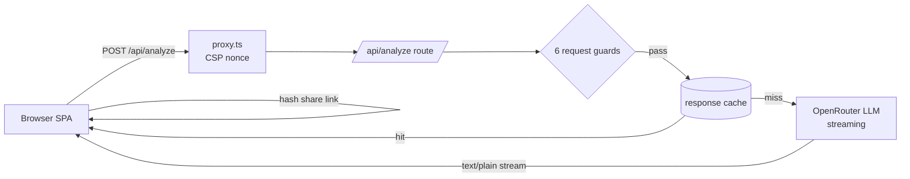
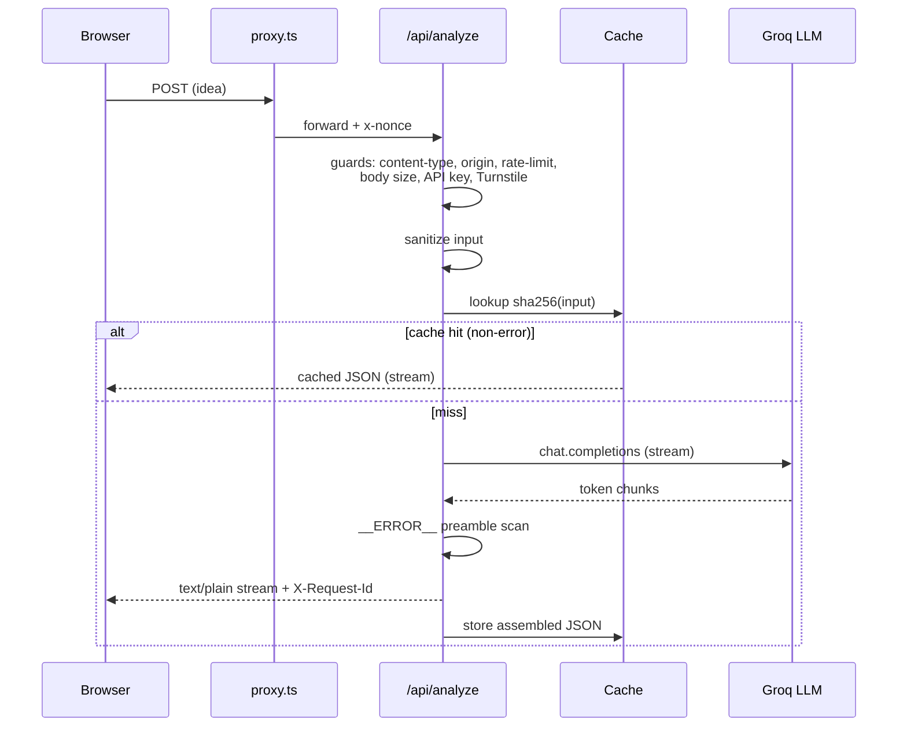

# Golden Circle Analyzer

[](https://github.com/alexmachulsky/golden-circle/actions/workflows/ci.yml)

[](https://scorecard.dev/viewer/?uri=github.com/alexmachulsky/golden-circle)

Turn a rough business idea into a structured **WHY / HOW / WHAT** strategy using Simon Sinek's Golden Circle framework — powered by AI, streamed in real time, and rendered as an interactive visualization.

## Features

- **AI-powered analysis** — streams a structured breakdown (1 WHY, 4 HOWs, 3 WHATs, 1 positioning note) from OpenRouter's `openai/gpt-oss-120b`
- **Interactive SVG visualization** — clickable concentric rings highlight each layer of the strategy
- **Animated loading state** — Framer Motion entrance animations while the model is working
- **Light / dark theme** — toggle persisted via cookie, applied before first paint to avoid flash
- **Copy, print, and save-as-PDF** — export the result without leaving the page
- **Example prompts** — pre-filled business ideas to try instantly
- **Input validation** — 50–2000 character range enforced on client and server

## Stack

- Next.js 16.2.3
- React 19.2.4
- TypeScript
- Tailwind CSS v4
- Framer Motion
- OpenAI SDK → OpenRouter (`openai/gpt-oss-120b`)

## Getting started

1. Install dependencies:

```bash
npm install
```

2. Create a local env file:

```bash
cp .env.local.example .env.local
```

3. Add your OpenRouter API key to `.env.local` (get one at [openrouter.ai/keys](https://openrouter.ai/keys)):

```
OPENROUTER_API_KEY=your_api_key_here
```

4. Start the development server:

```bash
npm run dev
```

Open [http://localhost:7001](http://localhost:7001).

## Available scripts

| Command | What it does |
| --- | --- |
| `npm run dev` | Start the Next.js dev server on port `7001` |
| `npm run build` | Create a production build |
| `npm run start` | Serve the production build on port `7001` |
| `npm run lint` | Run ESLint |
| `npx tsc --noEmit` | Type-check the project (same check as CI) |
| `npm test` | Run Vitest unit tests (single run, no watch) |
| `npm run test:watch` | Run Vitest in watch mode |

## Environment variables

| Name | Required | Description |
| --- | --- | --- |
| `OPENROUTER_API_KEY` | Yes | API key used by `app/api/analyze/route.ts` to call OpenRouter |
| `TURNSTILE_SITE_KEY` | Production | Public site key used to render the verification challenge |
| `TURNSTILE_SECRET_KEY` | Production | Secret key used server-side to verify submitted challenge tokens |
| `UPSTASH_REDIS_REST_URL` | Production | Shared rate-limit backend URL |
| `UPSTASH_REDIS_REST_TOKEN` | Production | Shared rate-limit backend token |
| `TRUSTED_IP_HEADER` | Production | Trusted proxy-injected client IP header |

## Docker

### Local (default)

The default Compose stack runs a single loopback-only container for local use:

```bash
cp .env.local.example .env.local   # add your OPENROUTER_API_KEY
docker compose up -d --build
```

It publishes only `127.0.0.1:7001`, reads the OpenRouter key from your gitignored `.env.local`, and sets `DEPLOYMENT_MODE=local` (in-memory rate limiter, no reverse proxy). The loopback binding means a naive `up` is never network-exposed. It is **not** for public deployment.

### Hardened production

For the proxied, secrets-backed public deployment, use the explicit production file:

```bash
mkdir -p secrets
# put the sensitive runtime values into:
#   secrets/openrouter_api_key.txt
#   secrets/upstash_redis_rest_token.txt
#   secrets/turnstile_secret_key.txt
export UPSTASH_REDIS_REST_URL="https://<region>-<name>.upstash.io"
export TURNSTILE_SITE_KEY="<your-public-site-key>"
docker compose -f docker-compose.prod.yml up -d --build
```

`docker-compose.prod.yml` fronts the app with the bundled `nginx.conf`, publishes only `127.0.0.1:7001`, and sets `TRUSTED_IP_HEADER=x-real-ip` so production rate limiting can trust the proxy-injected client IP. It expects `UPSTASH_REDIS_REST_URL`, `TURNSTILE_SITE_KEY`, and the Docker-secret-backed values under `/run/secrets/*` to be configured before `/api/analyze` will serve traffic. `.dockerignore` excludes local env files from the build context so secrets are never baked into the image.

Pre-built images are published to GitHub Container Registry on every merge to `main`. Use an immutable tag for production deployments:

```bash
docker pull ghcr.io/alexmachulsky/golden-circle:<git-sha>
```

### Kubernetes

Basic manifests for running on Minikube or EKS live in [`k8s/`](k8s/):

```
k8s/
  namespace.yaml
  configmap.yaml
  deployment.yaml
  service.yaml
```

Apply them with `kubectl apply -f k8s/` after creating the namespace and any required secrets.

The app must never trust a client-supplied forwarding header directly. The Kubernetes nginx ingress manifest sets `X-Real-IP` from the actual remote address and overwrites `X-Forwarded-For` before proxying to the app; `TRUSTED_IP_HEADER` must match that sanitized `x-real-ip` header. For an EKS ALB deployment, replace `k8s/ingress.yaml` with the ALB-specific equivalent and verify spoofed `X-Forwarded-For` requests cannot control the app's trusted client IP.

## CI/CD

GitHub Actions runs on every push and pull request to `main`. The main pipeline:

1. **Build** — compile source, produce Next.js artifacts
2. **Verify** (parallel with Secret Scan) — unit tests, lint, type-check, dependency audit
3. **Secret Scan** (parallel with Verify) — gitleaks scans the full git history for committed secrets
4. **Package** — Docker image build + Trivy vulnerability scan (results uploaded as SARIF)
5. **Publish** — push the image to GHCR (merges to `main` only, tagged with the commit SHA)

Two more security workflows run on their own schedule: **CodeQL** (JavaScript/TypeScript SAST) and **OpenSSF Scorecard** (supply-chain posture, surfaced via the README badge). All workflows pin third-party Actions by commit SHA.

## How it works

### Architecture



### Request flow



1. `components/InputForm.tsx` collects the business idea, shows example prompts, and enforces the 50–2000 character range.
2. `app/api/analyze/route.ts` sanitizes input, enforces production abuse-protection prerequisites (`TRUSTED_IP_HEADER`, Upstash, Turnstile), checks for `OPENROUTER_API_KEY`, and streams raw text from OpenRouter back to the browser.
3. `components/GoldenCircleApp.tsx` reads the stream, handles the `__ERROR__` sentinel used for stream-time failures, cleans up common LLM JSON formatting mistakes, and parses the final response into the shared `AnalysisResult` type.
4. `components/ResultSection.tsx` renders the final strategy breakdown and coordinates the interactive circle UI from `components/GoldenCircle.tsx`.

## Project structure

| Path | Role |
| --- | --- |
| `app/page.tsx` | Renders the single-page app shell |
| `app/layout.tsx` | Root layout; loads the same-origin theme bootstrap script before paint |
| `app/api/analyze/route.ts` | Server route that calls Groq and streams the result |
| `app/globals.css` | Tailwind v4 theme tokens, global styles, and print/PDF rules |
| `components/GoldenCircleApp.tsx` | Top-level client state machine for `input`, `loading`, and `result` |
| `components/GoldenCircle.tsx` | SVG ring visualization for WHY / HOW / WHAT |
| `components/ResultSection.tsx` | Result cards, copy action, print action, and section focus |
| `components/InputForm.tsx` | Business-idea input with validation and example prompts |
| `components/ThemeToggle.tsx` | Light/dark theme switcher using `useSyncExternalStore` |
| `lib/prompt.ts` | System prompt, user prompt builder, and example business ideas |
| `lib/theme.ts` | Theme helpers: bootstrap script, cookie persistence, store subscription |
| `types/index.ts` | Shared response schema used across the app |

## Contributing

Before opening a PR, run the full check suite:

```bash
npm run lint && npx tsc --noEmit && npm test && npm run build
```
