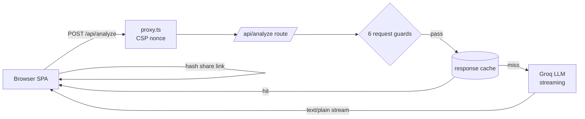
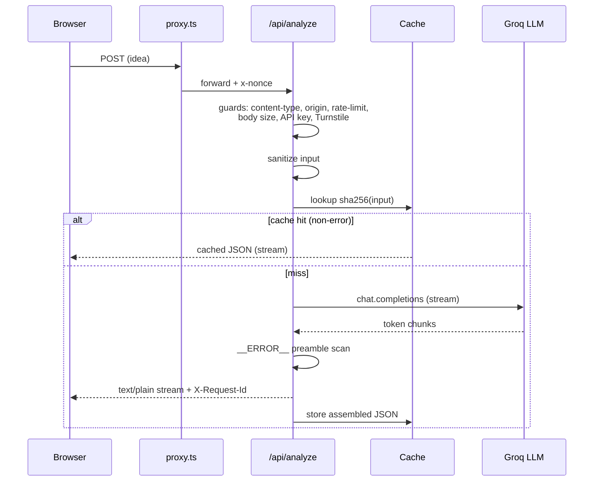

# Portfolio-grade DevOps & Security Hardening — Implementation Plan

> **For agentic workers:** REQUIRED SUB-SKILL: Use superpowers:subagent-driven-development (recommended) or superpowers:executing-plans to implement this plan task-by-task. Steps use checkbox (`- [ ]`) syntax for tracking.

**Goal:** Refine an already-mature Next.js app's DevOps/security posture into a polished, well-documented portfolio showcase: add SAST + secret scanning + Scorecard to CI, correct stale CSP docs (the nonce middleware is already active), cleanly commit the in-progress share-link work, and add structured logging plus security/architecture docs.

**Architecture:** Four independent phases executed in order. Phase A first to isolate pre-existing uncommitted work into clean commits; then additive CI workflows (Phase B); then a docs-only CSP correction (Phase C); then observability + documentation (Phase D). Each phase is independently verifiable and committed separately.

**Tech Stack:** Next.js 16.2.4 (App Router, standalone), TypeScript, Vitest, GitHub Actions (SHA-pinned), CodeQL, gitleaks, OpenSSF Scorecard, Docker, dependency-free JSON logging.

**Branch:** `devops-portfolio-hardening` (already created; design spec already committed there).

---

## File Map

| File | Phase | Responsibility |
|---|---|---|
| (existing working-tree changes) | A | Share-link feature + security tweaks → 2 clean commits |
| `.github/workflows/codeql.yml` | B | CodeQL JS/TS static analysis → Security tab |
| `.gitleaks.toml` | B | gitleaks allowlist (test keys, placeholders) |
| `.github/workflows/ci.yml` | B | Add `secret-scan` (gitleaks) job |
| `.github/workflows/scorecard.yml` | B | OpenSSF Scorecard → Security tab + badge |
| `README.md` | B, D | Scorecard badge; architecture + request-flow Mermaid diagrams |
| `CLAUDE.md` | C | Correct stale `proxy.ts`/CSP "inactive" note |
| `lib/logger.ts` | D | Dependency-free structured JSON logger + `newRequestId()` |
| `lib/logger.test.ts` | D | Logger unit tests |
| `app/api/analyze/route.ts` | D | Thread `reqId`, emit `X-Request-Id`, use logger |
| `lib/analyze-cache.ts`, `lib/turnstile.ts`, `app/api/health/route.ts`, `app/layout.tsx` | D | Replace `console.*` with logger |
| `SECURITY.md` | D | Vulnerability disclosure policy |
| `docs/THREAT-MODEL.md` | D | Canonical current threat model |

---

## PHASE A — Commit & polish the in-progress work

The working tree contains a complete, tested share-link feature and 5 security tweaks. The two
sets touch **disjoint files**, so they commit cleanly as two logical commits. Do this first so
later edits don't entangle with the pre-existing changes.

Working-tree file groups (verified):
- **Share-link:** `lib/share-link.ts` (new), `lib/share-link.test.ts` (new), `components/GoldenCircleApp.tsx`, `components/ResultSection.tsx`
- **Security tweaks:** `app/api/analyze/route.ts`, `app/api/analyze/route.test.ts`, `lib/analyze-cache.test.ts` (new), `lib/security-headers.ts`, `lib/turnstile.ts`, `lib/validate-analysis.ts`

### Task A1: Verify the working tree is green before committing

- [ ] **Step 1: Run the full gate**

Run:
```bash
npm run lint && npx tsc --noEmit && npm test
```
Expected: lint clean, no type errors, all tests pass (includes the 16 share-link + cache tests).

- [ ] **Step 2: Confirm the two file groups are disjoint**

Run:
```bash
git status --short
```
Expected: exactly the 10 paths listed above (7 modified + 3 untracked). If anything else appears, stop and reconcile before committing.

### Task A2: Commit the share-link feature

- [ ] **Step 1: Stage only the share-link files**

Run:
```bash
git add lib/share-link.ts lib/share-link.test.ts components/GoldenCircleApp.tsx components/ResultSection.tsx
```

- [ ] **Step 2: Verify the staged set**

Run:
```bash
git diff --cached --name-only
```
Expected: exactly those 4 files.

- [ ] **Step 3: Commit**

```bash
git commit -m "$(cat <<'EOF'
feat: shareable result links

Encode an AnalysisResult into a base64url URL hash (#data=…, max 8 KB) so a
result can be shared via link; decode + re-validate via parseAnalysis on load.
Adds a Share button (ResultSection) and hash restore on first load
(GoldenCircleApp).

Co-Authored-By: Claude Opus 4.7 (1M context) <noreply@anthropic.com>
EOF
)"
```

### Task A3: Commit the security hardening tweaks

- [ ] **Step 1: Stage the remaining (security) files**

Run:
```bash
git add app/api/analyze/route.ts app/api/analyze/route.test.ts lib/analyze-cache.test.ts lib/security-headers.ts lib/turnstile.ts lib/validate-analysis.ts
```

- [ ] **Step 2: Verify the working tree is now clean after staging**

Run:
```bash
git status --short
```
Expected: all remaining entries are staged (prefixed `A`/`M` in the first column), nothing unstaged.

- [ ] **Step 3: Commit**

```bash
git commit -m "$(cat <<'EOF'
fix: security hardening tweaks

- reject non-string turnstileToken with 400 before verification
- never serve cached responses containing the __ERROR__ sentinel
- tighten CSP nonce regex to exact 16-byte base64 shapes
- correct the control/bidi sanitizer regex to explicit \u escapes
- Turnstile fails closed (503) when public production has no allowed hostnames
- reset the analyze response cache between route tests

Co-Authored-By: Claude Opus 4.7 (1M context) <noreply@anthropic.com>
EOF
)"
```

- [ ] **Step 4: Confirm clean tree**

Run:
```bash
git status --short
```
Expected: empty output.

---

## PHASE B — CI security signals

All additive. The repo pins GitHub Actions by commit SHA — preserve that. Reusable known-good
SHAs already in this repo:
- `actions/checkout@de0fac2e4500dabe0009e67214ff5f5447ce83dd` (v4)
- `github/codeql-action/*@95e58e9a2cdfd71adc6e0353d5c52f41a045d225` (v4)

For actions NOT already in the repo, resolve the SHA at implementation time with `gh` and pin it.

### Task B1: Add CodeQL SAST workflow

**Files:** Create `.github/workflows/codeql.yml`

- [ ] **Step 1: Write the workflow**

```yaml
name: CodeQL

on:
  push:
    branches: [main]
  pull_request:
    branches: [main]
  schedule:
    - cron: "27 3 * * 1" # Mondays 03:27 UTC

# Least-privilege default
permissions:
  contents: read

jobs:
  analyze:
    name: Analyze (javascript-typescript)
    runs-on: ubuntu-latest
    permissions:
      contents: read
      security-events: write # upload SARIF to the Security tab

    steps:
      - uses: actions/checkout@de0fac2e4500dabe0009e67214ff5f5447ce83dd # v4

      - name: Initialize CodeQL
        uses: github/codeql-action/init@95e58e9a2cdfd71adc6e0353d5c52f41a045d225 # v4
        with:
          languages: javascript-typescript
          queries: security-extended

      # JS/TS is interpreted — no build step needed for CodeQL extraction.
      - name: Perform CodeQL Analysis
        uses: github/codeql-action/analyze@95e58e9a2cdfd71adc6e0353d5c52f41a045d225 # v4
        with:
          category: "/language:javascript-typescript"
```

- [ ] **Step 2: Validate YAML syntax**

Run:
```bash
python3 -c "import yaml,sys; yaml.safe_load(open('.github/workflows/codeql.yml')); print('codeql.yml OK')"
```
Expected: `codeql.yml OK`

- [ ] **Step 3: Commit**

```bash
git add .github/workflows/codeql.yml
git commit -m "ci: add CodeQL static analysis (javascript-typescript)

Co-Authored-By: Claude Opus 4.7 (1M context) <noreply@anthropic.com>"
```

### Task B2: Add gitleaks secret scanning

**Files:** Create `.gitleaks.toml`; Modify `.github/workflows/ci.yml` (add a `secret-scan` job)

- [ ] **Step 1: Write the gitleaks allowlist config**

Create `.gitleaks.toml`:
```toml
title = "gitleaks config — golden-circle"

# Start from gitleaks' built-in rules, then add an allowlist for known-safe
# strings that would otherwise be flagged.
[extend]
useDefault = true

[allowlist]
description = "Public test keys and placeholder secret files"
paths = [
  '''secrets/.*\.txt''',       # Docker-secret placeholders (empty/local-only)
  '''\.env\.local\.example''', # documented example values only
]
regexes = [
  '''1x0{8,}[A-Za-z0-9]*''',   # Cloudflare Turnstile public TEST site/secret keys
  '''2x0{8,}[A-Za-z0-9]*''',
  '''3x0{8,}[A-Za-z0-9]*''',
]
```

- [ ] **Step 2: Resolve and record the gitleaks-action SHA**

Run:
```bash
gh api repos/gitleaks/gitleaks-action/commits/v2 --jq '.sha'
```
Expected: a 40-char hex SHA. Note it — substitute it for `<GITLEAKS_SHA>` in the next step. (If `gh` is unavailable, fetch from https://github.com/gitleaks/gitleaks-action/commits/v2.)

- [ ] **Step 3: Add the `secret-scan` job to `.github/workflows/ci.yml`**

Insert a new job after the `verify` job (and before `package`). Use the SHA from Step 2:
```yaml
  # ── 2b. SECRET SCAN ─────────────────────────────────────────────────────────
  secret-scan:
    name: Secret Scan (gitleaks)
    runs-on: ubuntu-latest
    needs: build

    steps:
      - uses: actions/checkout@de0fac2e4500dabe0009e67214ff5f5447ce83dd # v4
        with:
          fetch-depth: 0 # full history so historical leaks are caught

      - name: Run gitleaks
        uses: gitleaks/gitleaks-action@<GITLEAKS_SHA> # v2
        env:
          GITLEAKS_CONFIG: .gitleaks.toml
```

- [ ] **Step 4: Make `package` wait on `secret-scan` too**

In `.github/workflows/ci.yml`, change the `package` job's dependency line:
```yaml
  package:
    name: Package & Scan
    runs-on: ubuntu-latest
    needs: [verify, secret-scan]
```
(Original was `needs: verify`.)

- [ ] **Step 5: Validate YAML syntax**

Run:
```bash
python3 -c "import yaml; yaml.safe_load(open('.github/workflows/ci.yml')); print('ci.yml OK')"
```
Expected: `ci.yml OK`

- [ ] **Step 6: Commit**

```bash
git add .gitleaks.toml .github/workflows/ci.yml
git commit -m "ci: add gitleaks secret scanning

Co-Authored-By: Claude Opus 4.7 (1M context) <noreply@anthropic.com>"
```

### Task B3: Add OpenSSF Scorecard workflow + README badge

**Files:** Create `.github/workflows/scorecard.yml`; Modify `README.md`

- [ ] **Step 1: Resolve SHAs for the Scorecard actions**

Run:
```bash
gh api repos/ossf/scorecard-action/commits/v2.4.0 --jq '.sha'   # -> <SCORECARD_SHA>
gh api repos/actions/upload-artifact/commits/v4 --jq '.sha'     # -> <UPLOAD_ARTIFACT_SHA>
```
Expected: two 40-char SHAs. Substitute below. (`github/codeql-action/upload-sarif` reuses the SHA already pinned in this repo.)

- [ ] **Step 2: Write the workflow**

Create `.github/workflows/scorecard.yml` (substitute the two SHAs from Step 1):
```yaml
name: Scorecard supply-chain security

on:
  branch_protection_rule:
  schedule:
    - cron: "18 4 * * 1" # Mondays 04:18 UTC
  push:
    branches: [main]

# Least-privilege default
permissions:
  contents: read

jobs:
  analysis:
    name: Scorecard analysis
    runs-on: ubuntu-latest
    permissions:
      security-events: write # upload SARIF to the Security tab
      id-token: write        # publish results to the public Scorecard API (badge)
      contents: read

    steps:
      - name: Checkout
        uses: actions/checkout@de0fac2e4500dabe0009e67214ff5f5447ce83dd # v4
        with:
          persist-credentials: false

      - name: Run analysis
        uses: ossf/scorecard-action@<SCORECARD_SHA> # v2.4.0
        with:
          results_file: results.sarif
          results_format: sarif
          publish_results: true # required for the README badge

      - name: Upload artifact
        uses: actions/upload-artifact@<UPLOAD_ARTIFACT_SHA> # v4
        with:
          name: SARIF file
          path: results.sarif
          retention-days: 5

      - name: Upload to Security tab
        uses: github/codeql-action/upload-sarif@95e58e9a2cdfd71adc6e0353d5c52f41a045d225 # v4
        with:
          sarif_file: results.sarif
```

- [ ] **Step 3: Validate YAML syntax**

Run:
```bash
python3 -c "import yaml; yaml.safe_load(open('.github/workflows/scorecard.yml')); print('scorecard.yml OK')"
```
Expected: `scorecard.yml OK`

- [ ] **Step 4: Add the Scorecard badge to README**

In `README.md`, immediately under the top `# Golden Circle Analyzer` heading, add a badge line. Determine the repo slug first:
```bash
gh repo view --json nameWithOwner --jq '.nameWithOwner'
```
Then insert (replace `OWNER/REPO` with that slug):
```markdown
[](https://scorecard.dev/viewer/?uri=github.com/OWNER/REPO)
```

- [ ] **Step 5: Commit**

```bash
git add .github/workflows/scorecard.yml README.md
git commit -m "ci: add OpenSSF Scorecard analysis and README badge

Co-Authored-By: Claude Opus 4.7 (1M context) <noreply@anthropic.com>"
```

---

## PHASE C — Correct the stale CSP documentation

**Finding (verified empirically):** `proxy.ts` is the **active** Next 16 proxy convention
(`middleware` was renamed to `proxy` in Next 16; a file exporting `proxy` or a default function is
picked up). A running dev server emits `script-src 'self' 'nonce-…'` and every script tag carries
the nonce. The CLAUDE.md note calling it "inactive" and advising a rename to `middleware.ts` is
stale and wrong. This phase corrects the docs and verifies production drops `'unsafe-inline'`.

### Task C1: Verify production CSP is strict

- [ ] **Step 1: Production build**

Run:
```bash
npm run build
```
Expected: build succeeds.

- [ ] **Step 2: Start the production server in the background**

Run:
```bash
(PORT=7001 GROQ_API_KEY=test-key npm run start > /tmp/gc-prod.log 2>&1 &) ; sleep 4
```

- [ ] **Step 3: Inspect the production CSP header**

Run:
```bash
curl -sI http://127.0.0.1:7001/ | grep -i content-security-policy
```
Expected: `script-src` contains `'nonce-…'` and does **NOT** contain `'unsafe-inline'` or `'unsafe-eval'`; `style-src` is `'self' 'nonce-…'` (no `'unsafe-inline'` on `style-src` itself; `style-src-attr 'unsafe-inline'` is the only `unsafe-inline`, which is the accepted Framer Motion exception).

- [ ] **Step 4: Confirm no CSP violations in a real browser load**

Use Playwright (or load `http://127.0.0.1:7001/` manually) and confirm the browser console shows
**zero** `Content-Security-Policy` violation errors and the page renders/hydrates. If using the
Playwright MCP: navigate, then read console messages and assert none contain "Content Security Policy".

- [ ] **Step 5: Stop the server**

Run:
```bash
pkill -9 -f "next-server" 2>/dev/null; pkill -9 -f "node server.js" 2>/dev/null; sleep 1; echo "stopped"
```

### Task C2: Correct the CLAUDE.md note

**Files:** Modify `CLAUDE.md`

- [ ] **Step 1: Replace the stale `proxy.ts` bullet**

In `CLAUDE.md`, find the bullet beginning ``- `proxy.ts` — CSP nonce middleware stub; **currently inactive**`` and replace the entire bullet with:
```markdown
- `proxy.ts` — per-request CSP nonce middleware. Next.js 16 renamed the `middleware` file convention to `proxy`, so this file (exporting `proxy` + `config.matcher`) is **active**: it generates a fresh nonce per request, forwards it to Server Components via the `x-nonce` request header, and sets the `Content-Security-Policy` response header via `buildContentSecurityPolicy()`. In production this yields a strict `script-src 'self' 'nonce-…'` / `style-src 'self' 'nonce-…'` policy (the only `'unsafe-inline'` is `style-src-attr`, an accepted Framer Motion exception). `next.config.ts` sets the remaining static security headers.
```

- [ ] **Step 2: Type-check (sanity — docs change, should be unaffected)**

Run:
```bash
npx tsc --noEmit
```
Expected: no errors.

- [ ] **Step 3: Commit**

```bash
git add CLAUDE.md
git commit -m "docs: correct stale proxy.ts/CSP note (middleware is active in Next 16)

Co-Authored-By: Claude Opus 4.7 (1M context) <noreply@anthropic.com>"
```

---

## PHASE D — Structured logging + security/architecture docs

### Task D1: Create the structured logger

**Files:** Create `lib/logger.ts`; Test `lib/logger.test.ts`

- [ ] **Step 1: Write the failing test**

Create `lib/logger.test.ts`:
```ts
import { afterEach, beforeEach, describe, expect, it, vi } from "vitest";
import { logger, newRequestId } from "./logger";

describe("logger", () => {
  beforeEach(() => {
    vi.spyOn(console, "log").mockImplementation(() => {});
    vi.spyOn(console, "warn").mockImplementation(() => {});
    vi.spyOn(console, "error").mockImplementation(() => {});
  });
  afterEach(() => vi.restoreAllMocks());

  it("emits one JSON line with ts, level, msg and merged fields", () => {
    logger.info("analyze", { reqId: "abc12345", cache: "hit", ms: 12 });
    expect(console.log).toHaveBeenCalledTimes(1);
    const line = (console.log as unknown as { mock: { calls: string[][] } }).mock.calls[0][0];
    const parsed = JSON.parse(line);
    expect(parsed.level).toBe("info");
    expect(parsed.msg).toBe("analyze");
    expect(parsed.reqId).toBe("abc12345");
    expect(parsed.cache).toBe("hit");
    expect(parsed.ms).toBe(12);
    expect(typeof parsed.ts).toBe("string");
  });

  it("routes warn to console.warn and error to console.error", () => {
    logger.warn("careful");
    logger.error("boom");
    expect(console.warn).toHaveBeenCalledTimes(1);
    expect(console.error).toHaveBeenCalledTimes(1);
    expect(console.log).not.toHaveBeenCalled();
  });

  it("newRequestId returns an 8-char lowercase hex id", () => {
    expect(newRequestId()).toMatch(/^[0-9a-f]{8}$/);
  });
});
```

- [ ] **Step 2: Run the test to verify it fails**

Run:
```bash
npx vitest run lib/logger.test.ts
```
Expected: FAIL — cannot resolve `./logger`.

- [ ] **Step 3: Write the logger**

Create `lib/logger.ts`:
```ts
// Minimal dependency-free structured logger. Emits one JSON object per line so
// aggregators (Loki, CloudWatch, etc.) parse fields directly. Log error
// *messages* and outcomes only — never secret values or raw user input.

export type LogLevel = "debug" | "info" | "warn" | "error";

export type LogFields = Record<string, string | number | boolean | null | undefined>;

/** Short, collision-resistant id for correlating one request's log lines. */
export function newRequestId(): string {
  return crypto.randomUUID().slice(0, 8);
}

function emit(level: LogLevel, msg: string, fields?: LogFields): void {
  const line = JSON.stringify({ ts: new Date().toISOString(), level, msg, ...fields });
  if (level === "error") console.error(line);
  else if (level === "warn") console.warn(line);
  else console.log(line);
}

export const logger = {
  debug: (msg: string, fields?: LogFields) => emit("debug", msg, fields),
  info: (msg: string, fields?: LogFields) => emit("info", msg, fields),
  warn: (msg: string, fields?: LogFields) => emit("warn", msg, fields),
  error: (msg: string, fields?: LogFields) => emit("error", msg, fields),
};
```

- [ ] **Step 4: Run the test to verify it passes**

Run:
```bash
npx vitest run lib/logger.test.ts
```
Expected: PASS (3 tests).

- [ ] **Step 5: Commit**

```bash
git add lib/logger.ts lib/logger.test.ts
git commit -m "feat: add dependency-free structured JSON logger

Co-Authored-By: Claude Opus 4.7 (1M context) <noreply@anthropic.com>"
```

### Task D2: Use the logger + request id in the analyze route

**Files:** Modify `app/api/analyze/route.ts`

- [ ] **Step 1: Import the logger**

Add to the imports block (after the `@/lib/constants` import on line 19):
```ts
import { logger, newRequestId } from "@/lib/logger";
```

- [ ] **Step 2: Generate the request id and per-request header objects**

Replace the opening of `POST` (lines 46–47):
```ts
export async function POST(req: Request) {
  let clientKey = "__local__";
```
with:
```ts
export async function POST(req: Request) {
  const reqId = newRequestId();
  const errorHeaders = { ...ERROR_HEADERS, "X-Request-Id": reqId };
  const streamHeaders = { ...STREAM_HEADERS, "X-Request-Id": reqId };
  let clientKey = "__local__";
```

- [ ] **Step 3: Swap the header constants for the per-request objects inside `POST`**

In `app/api/analyze/route.ts`, within the `POST` function only, replace every `headers: ERROR_HEADERS` with `headers: errorHeaders`, every `headers: STREAM_HEADERS` with `headers: streamHeaders`, the 429 case `{ ...ERROR_HEADERS, "Retry-After": "60" }` with `{ ...errorHeaders, "Retry-After": "60" }`, and the two `new Response(... , { headers: STREAM_HEADERS })` (cache hit + final return) with `streamHeaders`. Do NOT change the `const ERROR_HEADERS`/`const STREAM_HEADERS` definitions themselves.

- [ ] **Step 4: Replace the `console.*` calls with logger calls**

Make these exact replacements in `app/api/analyze/route.ts`:

| Old | New |
|---|---|
| `console.error("[analyze] rate-limit unavailable:", err.message);` | `logger.error("rate-limit unavailable", { reqId, err: err.message });` |
| `console.error("[analyze] failed to read GROQ_API_KEY:", err instanceof Error ? err.message : String(err));` | `logger.error("failed to read GROQ_API_KEY", { reqId, err: err instanceof Error ? err.message : String(err) });` |
| `console.error("[analyze] GROQ_API_KEY is not set");` | `logger.error("GROQ_API_KEY is not set", { reqId });` |
| `console.warn("[analyze] cache lookup failed:", err instanceof Error ? err.message : String(err));` | `logger.warn("cache lookup failed", { reqId, err: err instanceof Error ? err.message : String(err) });` |
| `console.warn("[analyze] cache write failed:", err instanceof Error ? err.message : String(err));` | `logger.warn("cache write failed", { reqId, err: err instanceof Error ? err.message : String(err) });` |
| `console.error("[analyze] upstream error:", err instanceof Error ? err.message : String(err));` | `logger.error("upstream error", { reqId, err: err instanceof Error ? err.message : String(err) });` |

- [ ] **Step 5: Type-check and run the route tests**

Run:
```bash
npx tsc --noEmit && npx vitest run app/api/analyze/route.test.ts
```
Expected: no type errors; route tests pass. (If a test asserts on exact response headers, update it to tolerate the added `X-Request-Id`.)

- [ ] **Step 6: Verify `X-Request-Id` is emitted (quick runtime check)**

Run:
```bash
npm run build >/dev/null 2>&1 && (PORT=7001 GROQ_API_KEY=test-key npm run start > /tmp/gc-prod.log 2>&1 &) ; sleep 4
curl -s -o /dev/null -D - -X POST http://127.0.0.1:7001/api/analyze \
  -H 'Content-Type: application/json' -H 'Origin: http://localhost:7001' \
  --data '{"businessIdea":"x"}' | grep -i "x-request-id\|HTTP/"
pkill -9 -f "next-server" 2>/dev/null; pkill -9 -f "node server.js" 2>/dev/null; echo done
```
Expected: response carries an `X-Request-Id` header (even on the 400 short-input path).

- [ ] **Step 7: Commit**

```bash
git add app/api/analyze/route.ts app/api/analyze/route.test.ts
git commit -m "feat: structured request logging + X-Request-Id in analyze route

Co-Authored-By: Claude Opus 4.7 (1M context) <noreply@anthropic.com>"
```

### Task D3: Replace remaining `console.*` call sites

**Files:** Modify `lib/analyze-cache.ts`, `lib/turnstile.ts`, `app/api/health/route.ts`, `app/layout.tsx`

- [ ] **Step 1: `lib/analyze-cache.ts`**

Add import at top: `import { logger } from "@/lib/logger";`
Replace:
| Old | New |
|---|---|
| `console.warn("[analyze-cache] upstash request failed:", err instanceof Error ? err.message : String(err));` | `logger.warn("cache upstash request failed", { err: err instanceof Error ? err.message : String(err) });` |
| `console.warn(\`[analyze-cache] upstash HTTP ${response.status}\`);` | `logger.warn("cache upstash non-ok", { status: response.status });` |
| `console.warn("[analyze-cache] upstash error:", payload.error);` | `logger.warn("cache upstash error", { err: String(payload.error) });` |

- [ ] **Step 2: `lib/turnstile.ts`**

Add import at top: `import { logger } from "@/lib/logger";`
Replace:
| Old | New |
|---|---|
| `console.warn("[turnstile] rejected:", errorCodes.length ? errorCodes.join(",") : "no-error-codes")` | `logger.warn("turnstile rejected", { codes: errorCodes.length ? errorCodes.join(",") : "no-error-codes" })` |
| `console.warn(\`[turnstile] action mismatch: got "${payload.action ?? ""}", expected "${TURNSTILE_ACTION}"\`)` | `logger.warn("turnstile action mismatch", { got: payload.action ?? "", expected: TURNSTILE_ACTION })` |
| `console.warn(\`[turnstile] hostname mismatch: got "${payload.hostname ?? ""}", allowed ${[...allowedHostnames].join(",")}\`)` | `logger.warn("turnstile hostname mismatch", { got: payload.hostname ?? "", allowed: [...allowedHostnames].join(",") })` |

- [ ] **Step 3: `app/api/health/route.ts`**

Add import at top: `import { logger } from "@/lib/logger";`
Replace the `console.warn("[health] degraded:", { … })` call (lines 56–61) with:
```ts
    logger.warn("health degraded", {
      groq: groqConfigured ? "ok" : "missing",
      rateLimit: rateLimitConfigured ? "ok" : "missing",
      trustedProxy: trustedProxyConfigured ? "ok" : "missing",
      turnstile: turnstileConfigured ? (turnstileEnabled ? "ok" : "disabled") : "missing",
    });
```

- [ ] **Step 4: `app/layout.tsx`**

Add import (with the other `@/lib` imports): `import { logger } from "@/lib/logger";`
Replace `console.error("[layout] Failed to read Turnstile site key:", e);` with:
```ts
    logger.error("layout failed to read Turnstile site key", { err: e instanceof Error ? e.message : String(e) });
```

- [ ] **Step 5: Confirm no stray `console.*` remain in app code**

Run:
```bash
grep -rn "console\.\(log\|warn\|error\|info\)" --include=*.ts --include=*.tsx app/ lib/ | grep -v ".test." | grep -v node_modules
```
Expected: only matches inside `lib/logger.ts` (the `emit` function). No other lines.

- [ ] **Step 6: Full gate**

Run:
```bash
npm run lint && npx tsc --noEmit && npm test
```
Expected: all green.

- [ ] **Step 7: Commit**

```bash
git add lib/analyze-cache.ts lib/turnstile.ts app/api/health/route.ts app/layout.tsx
git commit -m "refactor: route remaining logs through the structured logger

Co-Authored-By: Claude Opus 4.7 (1M context) <noreply@anthropic.com>"
```

### Task D4: Add SECURITY.md

**Files:** Create `SECURITY.md`

- [ ] **Step 1: Write SECURITY.md**

Create `SECURITY.md`:
```markdown
# Security Policy

## Supported Versions

This project is deployed as a single rolling release from `main`. Only the
latest `main` (and the most recently published container image) receives
security fixes.

| Version | Supported |
| ------- | --------- |
| `main` (latest) | ✅ |
| older commits / tags | ❌ |

## Reporting a Vulnerability

Please report security issues **privately** — do not open a public issue.

1. Use GitHub's **Report a vulnerability** button under the repository's
   **Security** tab (Private Vulnerability Reporting), or
2. Email the maintainer listed on the GitHub profile.

Include: affected endpoint/file, reproduction steps, and impact. You can expect
an acknowledgement within 7 days and a status update within 30 days.

## Scope

In scope: the application code (`app/`, `lib/`, `components/`), the API route
(`/api/analyze`), the container image, and the CI/CD pipeline.

Out of scope: third-party services (Groq, Cloudflare Turnstile, Upstash) — report
those to the respective vendors. Denial-of-service via the documented rate limits
is expected behavior, not a vulnerability.

## Security Model

See [`docs/THREAT-MODEL.md`](docs/THREAT-MODEL.md) for the trust boundaries,
request-guard chain, and hardening posture.
```

- [ ] **Step 2: Commit**

```bash
git add SECURITY.md
git commit -m "docs: add SECURITY.md vulnerability disclosure policy

Co-Authored-By: Claude Opus 4.7 (1M context) <noreply@anthropic.com>"
```

### Task D5: Add the canonical threat model

**Files:** Create `docs/THREAT-MODEL.md`

- [ ] **Step 1: Write the threat model**

Create `docs/THREAT-MODEL.md`:
```markdown
# Threat Model — Golden Circle Analyzer

_Last reviewed: 2026-05-24. This is the canonical, current threat model. Dated
`docs/security-review-*.md` files are retained as historical provenance._

## System overview

A single-page Next.js app. The only state-changing entry point is
`POST /api/analyze`, which proxies a sanitized business-idea string to the Groq
LLM and streams the response back. There is no user database, no authentication,
and no persistent user data — the only stored state is a short-lived response
cache keyed by a hash of the sanitized input.

## Trust boundaries

| Boundary | Untrusted input | Control |
| --- | --- | --- |
| Browser → `/api/analyze` | request body, headers, origin | 6-guard chain (below) |
| Reverse proxy → app | client IP header | `TRUSTED_IP_HEADER`; nginx strips client-supplied IP headers |
| App → Groq | sanitized prompt | input sanitization + length caps + prompt-injection sentinel scan |
| Groq → Browser | LLM output | `__ERROR__` preamble scan; client re-validates JSON shape |
| Shared link → app | `#data=` URL hash | size cap (8 KB) + `parseAnalysis` re-validation |

## Request-guard chain (`/api/analyze`)

Executed in order; each returns a JSON error with the correct status before any
LLM call:

1. **Content-Type** — must be `application/json` (415).
2. **Origin** — must match `ALLOWED_ORIGINS` (403).
3. **Rate limit** — per-client token bucket; fails closed in public production
   without shared Upstash + trusted IP header (429 / 503).
4. **Body size** — 8 KB cap before parsing (413).
5. **API key** — `GROQ_API_KEY` presence (500 if missing).
6. **Human verification** — optional Cloudflare Turnstile, with action +
   hostname binding; fails closed in public production if misconfigured (503).

## Key risks & mitigations

- **Prompt injection / sentinel forgery** — the server buffers the stream
  preamble and rejects an LLM response that tries to emit the `__ERROR__`
  sentinel; the cache never stores `__ERROR__` payloads.
- **XSS** — strict CSP with per-request nonce (`script-src 'self' 'nonce-…'`);
  React escaping; output sanitizer strips control/bidi characters. Only
  `style-src-attr 'unsafe-inline'` remains (Framer Motion runtime styles).
- **Clickjacking** — `frame-ancestors 'none'` + `X-Frame-Options: DENY`.
- **IP spoofing for rate-limit evasion** — nginx overwrites client-supplied IP
  headers; only the proxy-injected `TRUSTED_IP_HEADER` is trusted.
- **Secret exposure** — secrets read on demand via `*_FILE` Docker secrets
  restricted to `/run/secrets`|`/var/secrets` in production; never baked into the
  image; CI runs gitleaks + restricts token permissions (least privilege).
- **Supply chain** — pinned base-image digest, `npm ci --ignore-scripts`,
  SHA-pinned GitHub Actions, Trivy image scan (CRITICAL/HIGH gate), CodeQL SAST,
  SBOM + SLSA provenance on publish, Dependabot, OpenSSF Scorecard.
- **Untrusted shared-link data** — decoded `#data=` payload is size-capped and
  re-validated through the same `parseAnalysis` schema as live responses.

## Residual risk / accepted exceptions

- `style-src-attr 'unsafe-inline'` is accepted to support Framer Motion runtime
  `style=` attributes; script execution remains nonce-only.
- `DEPLOYMENT_MODE=local` intentionally relaxes the rate-limiter and proxy
  requirements for loopback/LAN use only (documented, not for public exposure).
```

- [ ] **Step 2: Commit**

```bash
git add docs/THREAT-MODEL.md
git commit -m "docs: add canonical threat model

Co-Authored-By: Claude Opus 4.7 (1M context) <noreply@anthropic.com>"
```

### Task D6: Add architecture + request-flow diagrams to README

**Files:** Modify `README.md`

- [ ] **Step 1: Insert diagrams under the `## How it works` heading**

In `README.md`, immediately after the `## How it works` heading line, insert:
````markdown
### Architecture



### Request flow


````

- [ ] **Step 2: Validate the Mermaid blocks are well-formed markdown fences**

Run:
```bash
grep -c '```mermaid' README.md
```
Expected: `2`

- [ ] **Step 3: Commit**

```bash
git add README.md
git commit -m "docs: add architecture and request-flow diagrams to README

Co-Authored-By: Claude Opus 4.7 (1M context) <noreply@anthropic.com>"
```

---

## Final verification (after all phases)

- [ ] **Step 1: Full gate**

Run:
```bash
npm run lint && npx tsc --noEmit && npm run build && npm test
```
Expected: all green.

- [ ] **Step 2: Docker build sanity (runtime config change touched logging in routes)**

Run:
```bash
docker compose -f docker-compose.local.yml up -d --build && sleep 8 \
  && curl -s -o /dev/null -w "%{http_code}\n" http://127.0.0.1:7001/api/health \
  && docker compose -f docker-compose.local.yml down
```
Expected: build succeeds; health returns `200` (or `503` only if `GROQ_API_KEY` is unset locally — confirm the code path, not a crash).

- [ ] **Step 3: Clean tree + branch ready for PR**

Run:
```bash
git status --short && git log --oneline main..HEAD
```
Expected: clean tree; the commit list shows the design spec + the phase commits in order.

---

## Notes for the executor

- **Do not** rename `proxy.ts` to `middleware.ts` — that is the old Next ≤15 convention and would
  be wrong for Next 16. `proxy.ts` is correct and active.
- Preserve SHA-pinning for all GitHub Actions; resolve unknown SHAs with `gh api` (steps provide
  the exact commands).
- If a route test asserts on the exact header set, extend it to allow `X-Request-Id` rather than
  removing the header.
- Redaction discipline in logs: log error *messages* and outcomes only — never key values, tokens,
  or raw user input.
